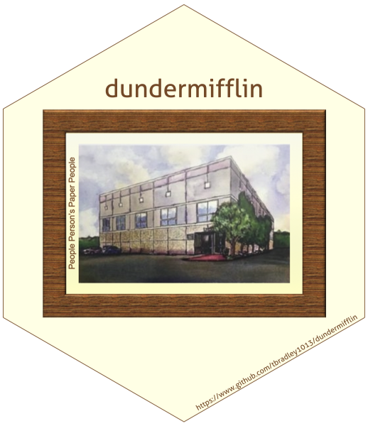

<!-- README.md is generated from README.Rmd. Please edit that file -->

```{r setup, include = FALSE}
knitr::opts_chunk$set(
  collapse = TRUE,
  comment = "#>",
  fig.path = "man/figures/README-",
  out.width = "100%"
)
```

# dundermifflin 

An R package to get The Office quotes whenever you want!


## Installation

``` r
remotes::install_github("tbradley1013/dundermifflin")
```

```{r}
library(dundermifflin)
```

## Usage


### `get_quote`

The main function of the package is `get_quote`. This function by default returns one random quote from all of the main office cast. See `?filter_quotes` to see who is included in the main office option. 

```{r example, results="hide"}
get_quote()
#> I know exactly what he's talking about. I sprout mung beans on a damp paper 
#> towel in my desk drawer. Very nutritious. But they smell like death.
#> ~ Creed
#> Season 2, Episode 21 - Conflict Resolution
```


### Character Quotes

You can also get quotes for individual characters for all of the main cast using their individual functions. 

```{r, results="hide"}
michael()
#> Yeah, well I'm calling the Ungrateful Bi-atch Hotline!  Did you get all that?
#> ~ Michael
#> Season 3, Epsiode 20 - Product Recall

kelly()
#> Um, if I'm out, I'm going to sue this ENTIRE COMPANY for discrimination.
#> ~ Kelly
#> Season 7, Episode 6 - Costume Contest

dwight()
#> I don't want to alarm people, but there is a distinct chance that we are all 
#> about to be killed
#> ~ Dwight
#> Season 8, Episode 22 - Fundraiser

kevin()
#> Me mechanic not speak English. But he know what me mean when me say “car no go”, 
#> and we best friends.  So me think: why waste time, say lot word when few word do trick?
#> ~ Kevin
#> Season 8, Episode 2 - The Incentive
```


### Quotes by Department

You can also get quotes for specific departments!

```{r, results = "hide"}
sales()
#> Andy revealed himself to be a double agent.  At which point Dwight felt comfortable 
#> revealing that he also was double agent.  And then Michael announced to everybody 
#> that - get this- he was a double agent.  Oh, and it is 6:00.
#> ~ Jim
#> Season 6, Episode 9 - Murder


accounting()
#> Our office has an unusually large number of… unusually large people.
#> ~ Oscar
#> Season 9, Epsiode 19 - Stairmageddon

hr()
#> I cannot keep myself from Michael. Everything he does is sexy. He has 
#> this undeniable animal magnetism. He's a jungle cat. The man exudes sex. 
#> He can put both his legs behind his head.
#> ~ Holly
#> Season 7, Episode 15 - PDA
```


## Curated dataset

Over the next few months, I plan to work on creating a list of the funnier quotes I come across while using the `dundermifflin` package to create a curated data set of funny quotes that users can use as their source for random quotes! You can help with this! I have opened an issue named [Funny Quote Indices](https://github.com/tbradley1013/dundermifflin/issues/1) where you can paste the quote and the indices of the quote. In order to get the indices of the quotes you are seeing, be sure to set `idx = TRUE`

```{r, results = "hide"}
get_quote(idx = TRUE)
#> In a way it’s like I have a son. And who knows? Maybe someday they’ll hire 
#> someone who looks like a younger version of him. And then I’ll have a grandson.
#> ~ Dwight
#> Season 9, Episode 1 - New Guys
#> Quote Index: 43102
```


## Data

This package also comes with a tibble, `office_quotes`, that has all of the lines from the Office, with the exception of season 5. 

All of the data in this dataset was obtained from [theOffice-api](https://github.com/anGie44/theOffice-api).


